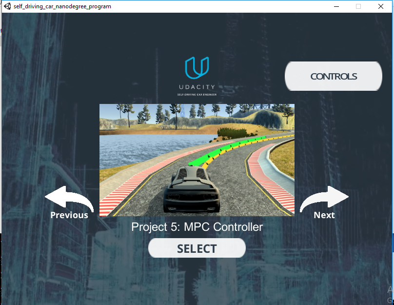
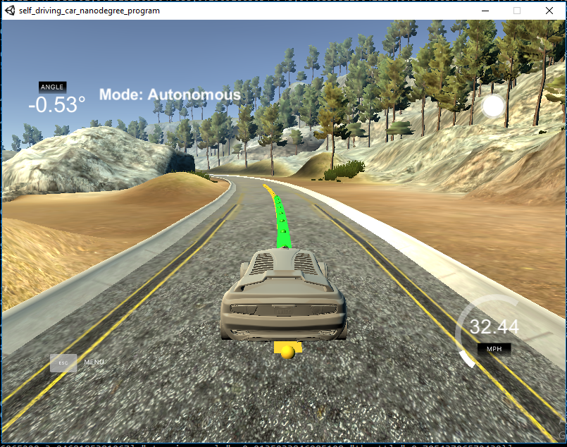

# CarND-Controls-MPC
Self-Driving Car Engineer Nanodegree Program

---

## Dependencies

* cmake >= 3.5
 * All OSes: [click here for installation instructions](https://cmake.org/install/)
* make >= 4.1(mac, linux), 3.81(Windows)
  * Linux: make is installed by default on most Linux distros
  * Mac: [install Xcode command line tools to get make](https://developer.apple.com/xcode/features/)
  * Windows: [Click here for installation instructions](http://gnuwin32.sourceforge.net/packages/make.htm)
* gcc/g++ >= 5.4
  * Linux: gcc / g++ is installed by default on most Linux distros
  * Mac: same deal as make - [install Xcode command line tools]((https://developer.apple.com/xcode/features/)
  * Windows: recommend using [MinGW](http://www.mingw.org/)
* [uWebSockets](https://github.com/uWebSockets/uWebSockets)
  * Run either `install-mac.sh` or `install-ubuntu.sh`.
  * If you install from source, checkout to commit `e94b6e1`, i.e.
    ```
    git clone https://github.com/uWebSockets/uWebSockets
    cd uWebSockets
    git checkout e94b6e1
    ```
    Some function signatures have changed in v0.14.x. See [this PR](https://github.com/udacity/CarND-MPC-Project/pull/3) for more details.

* **Ipopt and CppAD:** Please refer to [this document](https://github.com/udacity/CarND-MPC-Project/blob/master/install_Ipopt_CppAD.md) for installation instructions.
* [Eigen](http://eigen.tuxfamily.org/index.php?title=Main_Page). This is already part of the repo so you shouldn't have to worry about it.
* Simulator. You can download these from the [releases tab](https://github.com/udacity/self-driving-car-sim/releases).
* Not a dependency but read the [DATA.md](./DATA.md) for a description of the data sent back from the simulator.


## Basic Build Instructions

1. Clone this repo.
2. Make a build directory: `mkdir build && cd build`
3. Compile: `cmake .. && make`
4. Run it: `./mpc`.
5. Make sure to set the LD_LIBRARY_PATH to /usr/local/lib incase of ubuntu bash setup

## Tips

1. It's recommended to test the MPC on basic examples to see if your implementation behaves as desired. One possible example
is the vehicle starting offset of a straight line (reference). If the MPC implementation is correct, after some number of timesteps
(not too many) it should find and track the reference line.
2. The `lake_track_waypoints.csv` file has the waypoints of the lake track. You could use this to fit polynomials and points and see of how well your model tracks curve. NOTE: This file might be not completely in sync with the simulator so your solution should NOT depend on it.
3. For visualization this C++ [matplotlib wrapper](https://github.com/lava/matplotlib-cpp) could be helpful.)
4.  Tips for setting up your environment are available [here](https://classroom.udacity.com/nanodegrees/nd013/parts/40f38239-66b6-46ec-ae68-03afd8a601c8/modules/0949fca6-b379-42af-a919-ee50aa304e6a/lessons/f758c44c-5e40-4e01-93b5-1a82aa4e044f/concepts/23d376c7-0195-4276-bdf0-e02f1f3c665d)
5. **VM Latency:** Some students have reported differences in behavior using VM's ostensibly a result of latency.  Please let us know if issues arise as a result of a VM environment.

Now the MPC controller is running and listening on port 4567 for messages from the simulator. Next step is to open Udacity's simulator:
Using the left arrow, you need to go to the Project 5: MPC Controller:







# [Rubic](https://review.udacity.com/#!/rubrics/896/view) points

## Compilation

### Your code should compile.

The code compiles without errors or warnings. Additional libraries added for this project, Ipopt and CppAD.

## Implementation

### The Model

The model used is a Kinematic model, Kinematic models are simplifications of dynamic models that ignore tire forces, gravity, and mass.
This simplification reduces the accuracy of the models, but it also makes them more tractable.

The model equations are as follow:

```
x[t] = x[t-1] + v[t-1] * cos(psi[t-1]) * dt
y[t] = y[t-1] + v[t-1] * sin(psi[t-1]) * dt
psi[t] = psi[t-1] + v[t-1] / Lf * delta[t-1] * dt
v[t] = v[t-1] + a[t-1] * dt
cte[t] = f(x[t-1]) - y[t-1] + v[t-1] * sin(epsi[t-1]) * dt
epsi[t] = psi[t] - psides[t-1] + v[t-1] * delta[t-1] / Lf * dt
```

Where:

`x` : Car's position in x trajectory.
`y` : Car's position in y trajectory.
`psi` : Car's heading direction.
`v` : Car velocity.
`cte` : Cross-track error.
`epsi` : Orientation error.

Actuator input :
delta : Angle of the steering
a :  Acceleration

Additional Tuning of the cost funtion is done to solve sudden steering spike problem: 
fg[0] += 1000.0 * CppAD::pow(vars[delta_start + i + 1] - vars[delta_start + i], 2);

No additional tuning is done.


### Prediction Horizon, Timestep Length and Elapsed Duration (N & dt)

Final values for N and dt were reached with Trail and Error, With large value of timestamp and small value of duration, I saw some erroneous behaviours, With N value of 20 and dt value of 0.1 and a speed  of 35 mph, car was not moving properly on the trajectory.
After some tries I tried N = 10 and dt = 0.2, vehicle seems stable with this configuration.

### Polynomial Fitting and MPC Preprocessing

The waypoints provided by the simulator are transformed to the car cordinated using the below formula:
```
ptsx_trans( k ) = (ptsx[k] - px) * cos(psi) + (ptsy[k] - py) * sin(psi);
ptsy_trans( k ) = (ptsy[k] - py) * cos(psi) - (ptsx[k] - px) * sin(psi);
```
A third degree polynomial was used to compute the trajectory of the car. Since most real world road scenarios will fit in this approach.


### Model Predictive Control with Latency

In order to deal with the latency,which is quite possible in real world scnario, added delay of 100 m/s to the actuations.
Below are the code changes to acheive this:
```
double x_delay = (0 + v * delay)
double y_delay = 0
double psi_delay = 0 + v * delta / Lf * delay
double v_delay =  0 + v + a * delay
double cte_delay = cte + (v * sin(epsi) * delay)
double epsi_delay = epsi + v * delta / Lf * delay
```
## Simulation

### The vehicle must successfully drive a lap around the track.

The vehicle successfully drives a lap around the track. Here is a short video with the final parameters: [./videos/capture_vedio_1.MOV](./videos/capture_vedio_1.MOV).
